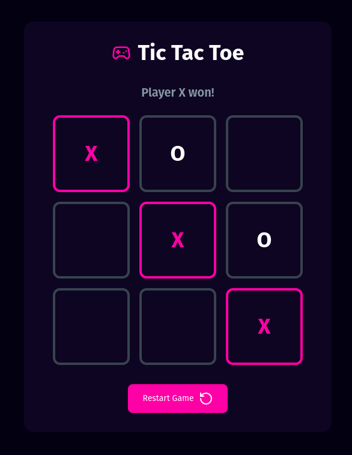

# React Tic Tac Toe

This project was developed as part of a Udemy course instructed by [Willian Justen](https://github.com/willianjusten).  
In this project, I learned more about Tailwind CSS configuration and had my first experience with the Motion library.

The game is a classic Tic Tac Toe, where players take turns with `X` and `O` to mark the board and determine a winner.

If you want to play this game just clone this repository and run the following commands:
```
npm install && npm run dev
```

Or you can play on this link: https://tic-tac-toe-zeta-ruddy.vercel.app/

## Board Preview
